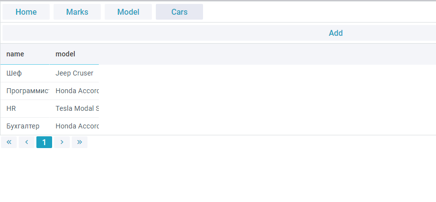
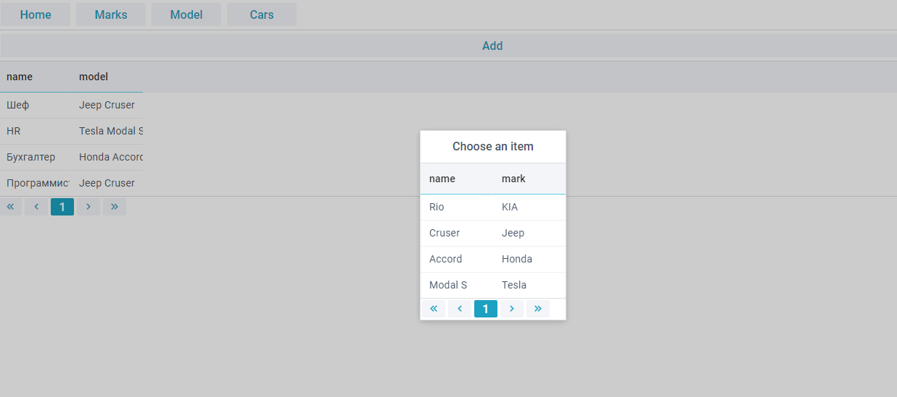

# Logistic

--------------------------

### Spring MVC and Webix application 

Учебный проект хранящий марку и модель автомобилей и кому принадлежит
данный автомобиль

#### В проекте используется следующие технологии:
* Spring MVC
* PostgreSQL
* Thymeleaf
* lombok

#### В frontend используется framework  [Webix](https://webix.com/)

